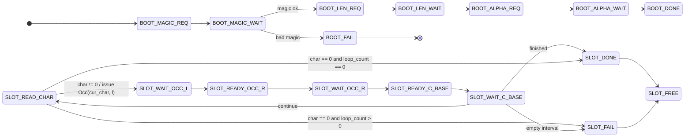
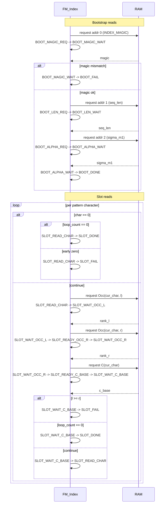

# FM_Index State Machine Overview

This document describes the control flow in [`fmindex_sv/FM_Index.sv`](/home/aolse/school/ece492/sands/fmindex_sv/FM_Index.sv).

The design is split into three parts:

1. A one-time bootstrap that reads the FM-index header after reset.
2. A slot scheduler that can keep multiple queries in flight at once.
3. A per-slot burst state machine that remembers which RAM transaction is in flight while the RAM delay counter runs.

## States Overview

- `BOOT_MAGIC_REQ`, `BOOT_LEN_REQ`, and `BOOT_ALPHA_REQ` issue the three bootstrap reads at addresses `0`, `1`, and `2`.
- `BOOT_MAGIC_WAIT`, `BOOT_LEN_WAIT`, and `BOOT_ALPHA_WAIT` are the corresponding bootstrap wait states.
- `BOOT_FAIL` is a terminal state if the header magic word is invalid.
- `BOOT_DONE` means bootstrap has completed and queries may be accepted.
- `SLOT_FREE` is an unused slot.
- `SLOT_READ_CHAR` consumes one pattern character and starts the next request burst for that slot.
- `SLOT_WAIT_OCC_L`, `SLOT_READY_OCC_R`, `SLOT_WAIT_OCC_R`, `SLOT_READY_C_BASE`, and `SLOT_WAIT_C_BASE` cover the three-read burst for one search step.
- `SLOT_DONE` and `SLOT_FAIL` are terminal states for a completed slot.

## Per-Slot Burst

The repeating search loop is:

1. `SLOT_READ_CHAR` fetches the current pattern character from `pattern[pat_idx]`.
2. The character is latched into `cur_char` for the whole three-read burst.
3. If the character is zero, the slot either finishes when the pattern is fully consumed or fails immediately if zero appears early.
4. Otherwise it requests `Occ(cur_char, l)` and enters `SLOT_WAIT_OCC_L`.
5. After the `Occ(cur_char, l)` response, the slot requests `Occ(cur_char, r)`.
6. After the `Occ(cur_char, r)` response, the slot requests `C(cur_char)`.
7. After the `C(cur_char)` response, the slot updates the search interval and either loops, finishes, or fails.

## Output Behavior

- `done` is asserted when `result_valid` and `result_done` are both high.
- `fail` is asserted when `result_valid` and `result_fail` are both high.
- `result_valid` pulses when a slot reaches `SLOT_DONE` or `SLOT_FAIL`.
- `result_done` and `result_fail` identify the result type.
- `result_query_id` tags that result so the simulator can print results back in submission order.
- `l_out` and `r_out` carry the completed interval for the emitted result.

## Bootstrap And Slot Flow

At a high level, the bootstrap state machine handles the three header reads
once after reset. After `BOOT_DONE`, the controller accepts search queries and
the slot states below handle the recurring `Occ` and `C` lookups during
backward search.

## Memory Operation Flow

`SLOT_WAIT_OCC_L`, `SLOT_WAIT_OCC_R`, and `SLOT_WAIT_C_BASE` serve two jobs:

1. Wait for the RAM delay to expire.
2. Perform the action associated with the completed memory request.

The request kind tells the slot state machine what to do when the response becomes available.

| `request kind` | Meaning | What happens when the response arrives |
| --- | --- | --- |
| `BOOT_MAGIC` | First bootstrap read | Check `ram_data` against `INDEX_MAGIC`. If valid, request the sequence length at address `1`. |
| `BOOT_LEN` | Read sequence length | Save `seq_len`, then request the alphabet length at address `2`. |
| `BOOT_ALPHA` | Read alphabet length | Save `sigma_m1`, mark bootstrap complete, and allow query slots to accept work. |
| `REQ_OCC_L` | Read `Occ(cur_char, l)` | Save `rank_l`, then request `Occ(cur_char, r)`. |
| `REQ_OCC_R` | Read `Occ(cur_char, r)` | Save `rank_r`, then request `C(cur_char)`. |
| `REQ_C_BASE` | Read `C(cur_char)` | Update `l` and `r`, then either loop, finish, or fail. |

## State And Sequence Diagram

The sequence diagram shows the request order and the state transitions into and
out of the bootstrap and burst-wait states.

The bootstrap reads these header fields:
- `addr 0`: `INDEX_MAGIC`
- `addr 1`: `seq_len`
- `addr 2`: `sigma_m1`

In the operational loop, a zero pattern symbol is only legal once the pattern
has been fully consumed. If `SLOT_READ_CHAR` sees `char == 0` before
`loop_count` reaches zero, that slot takes the `SLOT_FAIL` branch immediately.

## RAM is Async

The RAM is modeled as delayed, not combinational.

- `RAM_DELAY_CYCLES` is the number of cycles between request acceptance and response availability.
- `RAM_FIFO_DEPTH` is the maximum number of pending reads the RAM will allow.
- The controller now keeps several query slots active at once, but each slot still issues one burst at a time.

In practice, `FM_Index` can keep the shared RAM queue busier by interleaving
multiple slots, but each slot still consumes one character burst at a time.
That means the remaining bottleneck is now more about dependency depth than
about a single-query stall bubble.
