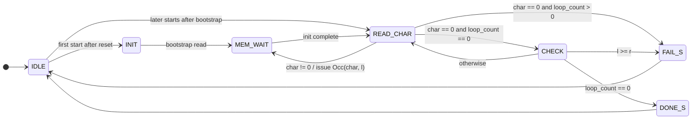
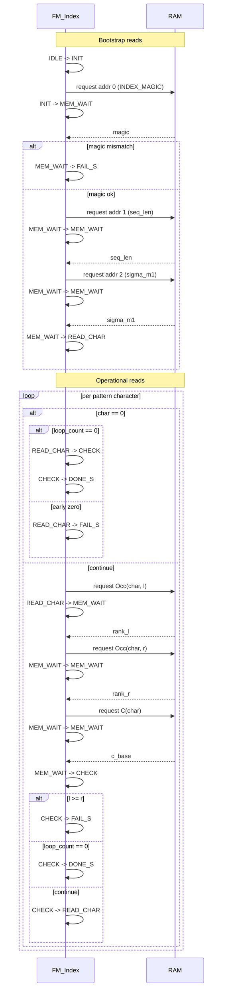

# FM_Index State Machine Overview

This document describes the control flow in [`fmindex_sv/FM_Index.sv`](/home/aolse/school/ece492/sands/fmindex_sv/FM_Index.sv).

The design is split into two parts:

1. A small top-level state machine that decides when to request RAM data.
2. A `mem_op` tag inside the search state that remembers which RAM transaction is in flight while the RAM delay counter runs.

## States Overview

- `IDLE` waits for `start` to go high.
- `INIT` performs the one-time bootstrap after reset, loading the header words from addresses `0`, `1`, and `2`.
- `MEM_WAIT` is a sub-state machine that waits until the delayed response for
  the current memory operation arrives, then decides what request or update
  comes next.
- `READ_CHAR` consumes one pattern character and starts the next occurrence-table read.
- `CHECK` decides whether to continue, stop with `done`, or stop with `fail`.
- `DONE_S` and `FAIL_S` pulse the output flags and then return to `IDLE`.

## Search Loop

The repeating search loop is:

1. `READ_CHAR` fetches the current pattern character from `pattern[pat_idx]`.
2. If the character is zero, the machine either skips to `CHECK` when the
   pattern is fully consumed or fails immediately if zero appears early.
3. Otherwise it requests `Occ(char, l)` and enters `MEM_WAIT` with `mem_op = OP_RANK_L`.
4. After the `Occ(char, l)` response, `MEM_WAIT` requests `Occ(char, r)`.
5. After the `Occ(char, r)` response, `MEM_WAIT` requests `C(char)`.
6. After the `C(char)` response, `MEM_WAIT` updates the search interval and enters `CHECK`.
7. `CHECK` either ends the search or decrements `pat_idx` and loops.

## Output Behavior

- `done` is asserted when the machine is in `DONE_S`.
- `fail` is asserted when the machine is in `FAIL_S`.
- `l_out` and `r_out` continuously reflect the current interval stored in `cur.l` and `cur.r`.

## Control State Diagram

At a high-level, the FSM state diagram is given below. `MEM_WAIT` has more complex behaviour, and the sequence diagram below shows how the RAM transactions line up with those state transitions.

## Memory Operation Flow

`MEM_WAIT` serves two jobs:

1. Wait for the RAM delay to expire.
2. Perform the action associated with the completed memory request.

The `mem_op` field tells `MEM_WAIT` what to do when the response becomes available.

| `mem_op` | Meaning | What happens when the response arrives |
| --- | --- | --- |
| `OP_INIT_MAGIC` | First bootstrap read | Check `ram_data` against `INDEX_MAGIC`. If valid, request the sequence length at address `1`. |
| `OP_INIT_LEN` | Read sequence length | Save `seq_len`, then request the alphabet length at address `2`. |
| `OP_INIT_ALPHA` | Read alphabet length | Save `sigma_m1`, initialize `l`, `r`, `loop_count`, and `pat_idx`, then enter `READ_CHAR`. |
| `OP_RANK_L` | Read `Occ(char, l)` | Save `rank_l`, then request `Occ(char, r)`. |
| `OP_RANK_R` | Read `Occ(char, r)` | Save `rank_r`, then request `C(char)`. |
| `OP_UPDATE` | Read `C(char)` | Update `l` and `r`, then move to `CHECK`. |

## State and Sequence Diagram

The sequence diagram shows the request order and the state transitions into and
out of `MEM_WAIT`. The bootstrap phase uses the first three header words once
after reset, then later pattern starts jump directly into `READ_CHAR` and reuse
`MEM_WAIT` for the recurring `Occ` and `C` lookups during backward search.

Note the bootstrap addresses (header fields) which are read before alignment:
- `addr 0`: `INDEX_MAGIC`
- `addr 1`: `seq_len`
- `addr 2`: `sigma_m1`

In the operational loop, a zero pattern symbol is only legal once the pattern
has been fully consumed. If `READ_CHAR` sees `char == 0` before `loop_count`
reaches zero, the controller now takes the `FAIL_S` branch immediately.

## RAM is Async

The RAM is modeled as delayed, not combinational.

- `RAM_DELAY_CYCLES` is the number of cycles between request acceptance and response availability.
- `RAM_FIFO_DEPTH` is the maximum number of pending reads the RAM will allow.
- The FSM only keeps one outstanding request at a time, but the RAM model is written so a deeper request queue can be used later.

In practice, `FM_Index` issues one request, waits for the response, and then
issues the next request in the same cycle that it consumes the previous
response. (**TODO**: pipeline RAM requests to reduce search latency. This will
change `MEM_WAIT` once again...)
